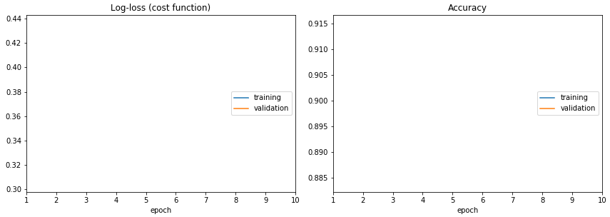

# Live Loss Plot


[](http://pepy.tech/count/livelossplot)

Don't train deep learning models blindfolded! Be impatient and look at each epoch of your training!

A live training loss plot in [Jupyter Notebook](http://jupyter.org/) for [Keras](https://keras.io/), [PyTorch](http://pytorch.org/) and other frameworks. An open source Python package by [Piotr Migdał](http://p.migdal.pl/) et al.

```
from livelossplot import PlotLossesKeras

model.fit(X_train, Y_train,
          epochs=10,
          validation_data=(X_test, Y_test),
          callbacks=[PlotLossesKeras()],
          verbose=0)
```



So remember, [log your loss](https://twitter.com/pmigdal/status/943764924983017473)!

* (The most FA)Q: Why not TensorBoard?
* A: Jupyter Notebook compatibility (for exploration and teaching). Simplicity of use.

## Installation

To install [this verson from PyPI](https://pypi.org/project/livelossplot/), type:

```
pip install livelossplot
```

To get the newest one from this repo (note that we are in the alpha stage, so there may be frequent updates), type:

```
pip install git+git://github.com/stared/livelossplot.git
```

## Examples

Look at notebook files with full working [examples](https://github.com/stared/livelossplot/blob/master/examples/):

* [keras.ipynb](https://github.com/stared/livelossplot/blob/master/examples/keras.ipynb) - a Keras callback
* [minimal.ipynb](https://github.com/stared/livelossplot/blob/master/examples/minimal.ipynb) - a bare API, to use anywhere
* [pytorch.ipynb](https://github.com/stared/livelossplot/blob/master/examples/pytorch.ipynb) - a bare API, as applied to PyTorch
* [pytoune.ipynb](https://github.com/stared/livelossplot/blob/master/examples/pytoune.ipynb) - a PyToune callback ([PyToune](https://pytoune.org/) is a Keras-like framework for PyTorch)

## Overview

Text logs are easy, but it's easy to miss the most crucial information: is it learning, doing nothing or overfitting?

Visual feedback allows us to keep track of the training process. Now there is one for Jupyter.

If you want to get serious - use [TensorBoard](https://www.tensorflow.org/programmers_guide/summaries_and_tensorboard) or even better - [Neptune - Machine Learning Lab](https://neptune.ml/) (as it allows to compare between models, in a Kaggle leaderboard style).

But what if you just want to train a small model in Jupyter Notebook? Here is a way to do so, using `livelossplot` as a plug&play component.

It started as [this gist](https://gist.github.com/stared/dfb4dfaf6d9a8501cd1cc8b8cb806d2e). Since it went popular, I decided to rewrite it as a package.

## To do

* Add [Bokeh](https://bokeh.pydata.org/) backend
* History saving
* Add connectors to TensorBoard and Neptune

If you want more functionality - open an [Issue](https://github.com/stared/livelossplot/issues) or even better - prepare a [Pull Request](https://github.com/stared/livelossplot/pulls).
